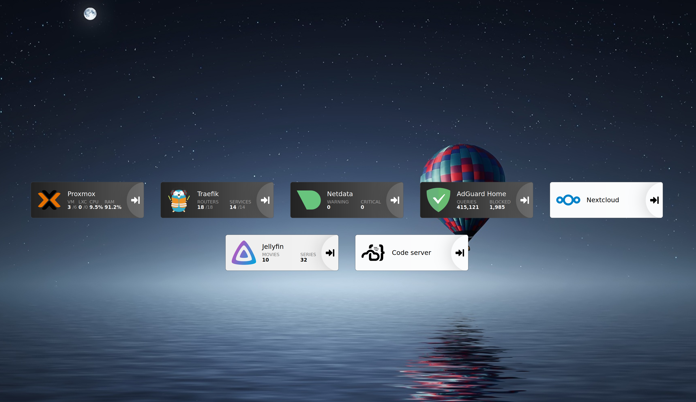

PiNanas
========

**Cloud services, safely hosted at home.**

Description
-----------
PiNanas is a private cloud platform including a wild range of services, safely hosted at home or on
privately managed infrastructure. It is modular, flexible and open to extensions. Build with security
and ease of use in mind, PiNanas will empower you to transform any hardware (old computer, Raspberry
Pi, ...) into a homelab and private cloud.

Access your files from anywhere on the world. Never lose a photo. Wonder no more how to play videos on your TV.

### What can I do with PiNanas?

PiNanas includes:
- A private cloud platform:
  - [Nextcloud](https://nextcloud.com "Nextcloud homepage"):
    store, access and share your files, and more...
  - [Jellyfin](https://jellyfin.org  "Jellyfin homepage"):
    manage and stream your films and tv shows.
- Network management:
  - [AdGuard Home](https://adguard.com/en/adguard-home/overview.html "AdGuard Home homepage"):
    protect your privacy and filter out advertising on all devices.
- Security and monitoring tools:
  - [Traefik](https://traefik.io/traefik "Traefik homepage"):
    simplify networking complexity while designing, deploying, and operating applications.
  - [Authelia](https://www.authelia.com "Authelia homepage"):
    rely on the Single Sign-On Multi-Factor portal for all PiNanas apps.
  - [Netdata](https://www.netdata.cloud "Netdata homepage"):
    monitor your infrastructure resources.

Installation
------------

### Requirements

#### Hardware

PiNanas will need a linux-based host, with:
- 10GB free disk space
- 4GB RAM, 8GB suggested
- An access to Internet
- Optionnally: a GPU suited to your needs (video transcoding & playing)

#### Software

During installation or operation, PiNanas requires:
- GNU utils
- python3 and pip
- docker and docker-compose
- a wildcard (sub)domain name (e.g. `*.home.example.com`); read [How to get a domain name?](doc/get-a-domain-name.md) for more information

Read [INSTALLATION](doc/INSTALL.md) for a step-by-step guide on how to install PiNanas at home.

Contributing
------------

PiNanas is highly modular and can be extended. You can:
- [Link a service external to PiNanas](doc/external-services.md) into it's perimeter, to enhance interoperability, security and visibility of an application.
- Enhance PiNanas by [contributing](doc/CONTRIBUTE.md) to this repository: feature request, bug report, pull request ...

Who are we?
-----------

PiNanas was born in 2020 during the Covid Pandemic when two friends discussed their frustrations
around tentatives to setup Plex in a controlled environment, on low-cost hardware (Raspberry Pi 3).

It is about this time that [Techno Tim](https://www.technotim.live "Techno Tim homepage") published [a
video on Youtube](https://youtu.be/pAM2GBCDGTo "Self-Hosting Your Homelab Services with SSL -- Let's
Encrypt, MetalLB, Traefik, Rancher, Kubernetes") on how to setup Traefik on a homelab, first of a series
on homelab services. These videos have been a continuing source of inspiration for us. What we tinkered
with became its own thing, and The Wife named it PiNanas: a
[NAS](https://en.wikipedia.org/wiki/Network-attached_storage "Network-attached storage") on a
[Pi](https://www.raspberrypi.org/ "Raspberry Pi")!

We'd be sincerly pleased to see you find interest in our toy project.

--- [Yankel Scialom](https://github.com/yscialom "YSC on Github") and GLE.
